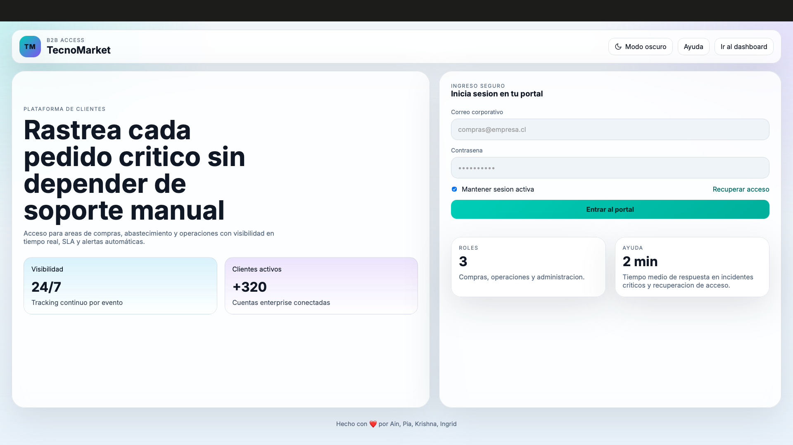
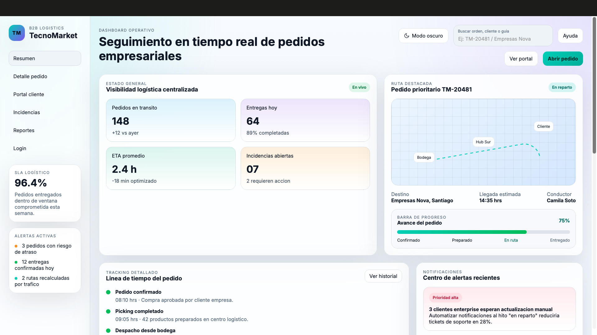
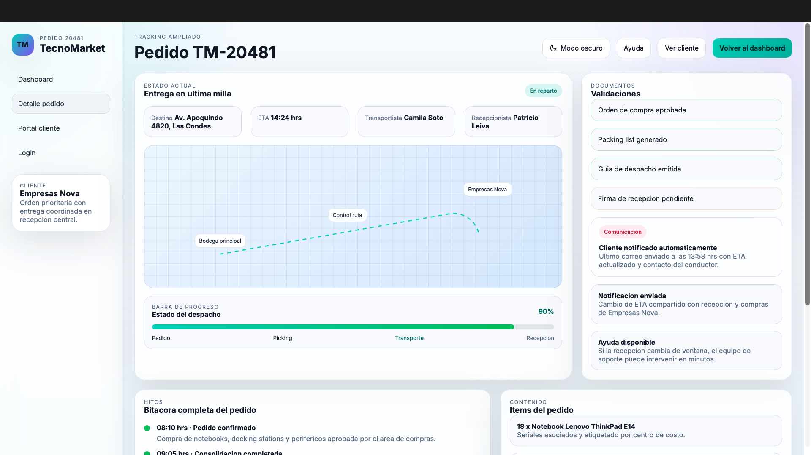
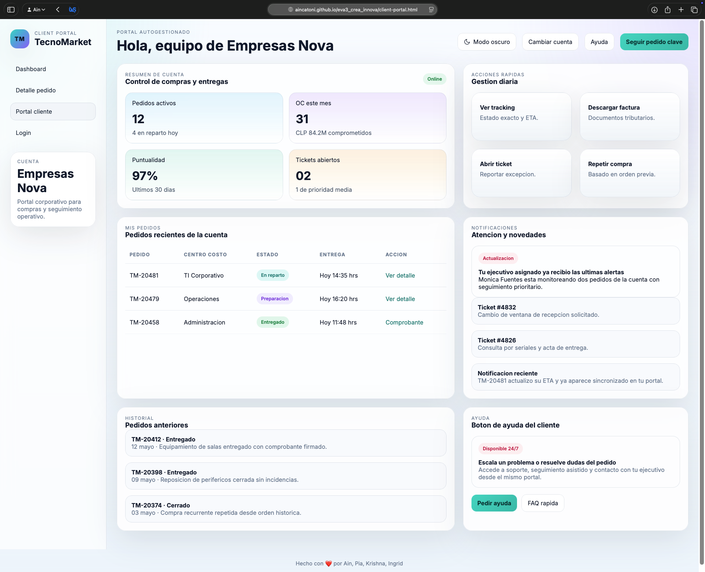

# [TecnoMarket B2B Dashboard](https://aincatoni.github.io/eva3_crea_innova/)

Dashboard web orientado a la gestion logistica B2B de **TecnoMarket**, enfocado en entregar visibilidad en tiempo real del estado de pedidos empresariales, cumplimiento de SLA y gestion de incidencias.

## Descripcion del proyecto

Este proyecto simula una plataforma operativa para equipos de compras, abastecimiento y operaciones. La interfaz centraliza informacion clave del ciclo logistico para facilitar decisiones rapidas sin depender de soporte manual.

Incluye:

- Seguimiento en tiempo real de pedidos prioritarios.
- Visualizacion de metricas operativas (transito, entregas, ETA e incidencias).
- Linea de tiempo del pedido con hitos de preparacion, despacho y entrega.
- Centro de alertas con estados y prioridades.
- Monitoreo por cliente con nivel de cumplimiento comprometido.

## Modulos principales

- **Dashboard operativo** (`dashboard.html`): vista general con KPIs, estado de ruta, barra de progreso y alertas activas.
- **Detalle de pedido** (`order-detail.html`): informacion completa de una orden, validaciones y bitacora.
- **Portal cliente** (`client-portal.html`): experiencia para cuentas empresariales con pedidos recientes y accesos de ayuda.
- **Incidencias** (`incidencias.html`): gestion de tickets logisticos y runbook de atencion.
- **Reportes** (`reportes.html`): indicadores de desempeno, cumplimiento y oportunidades de mejora.
- **Login/Acceso** (`index.html` y `login.html`): entrada al ecosistema B2B.

## Caracteristicas tecnicas

- Desarrollado con **HTML5, CSS3 y JavaScript vanilla**.
- Interfaz responsive para escritorio y mobile.
- Simulacion de actualizacion dinamica de ETA y avance de ruta.
- Busqueda de pedidos/clientes en tablas de seguimiento.
- Soporte de tema claro/oscuro con persistencia local.

## Objetivo

Mostrar una propuesta funcional de dashboard B2B para TecnoMarket que combine trazabilidad de pedidos, control operativo y comunicacion proactiva con clientes empresa.

## Capturas de las vistas del proyecto

# Vista principal / Login

# Resumen / Dashboard

# Detalle pedido

# Portal del cliente

## Como visualizar el proyecto

A) Puedes ver el proyecto en: https://aincatoni.github.io/eva3_crea_innova/

B) Puedes ver el proyecto en tu local:

1. Clona o descarga este repositorio.
2. Abre `index.html` en tu navegador.
3. Navega entre los modulos desde el menu lateral o enlaces internos.

---

Proyecto academico para la unidad **Crea e Innova**.
